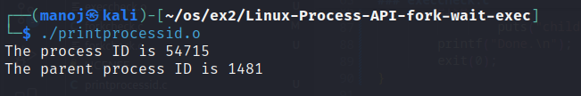
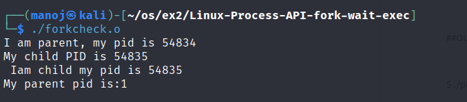
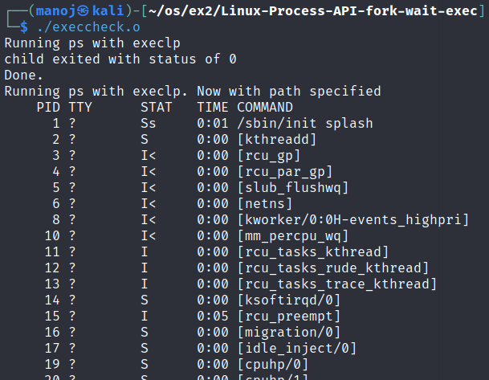

# Linux-Process-API-fork-wait-exec-
Ex02-Linux Process API-fork(), wait(), exec()
# Ex02-OS-Linux-Process API - fork(), wait(), exec()
Operating systems Lab exercise


# AIM:
To write C Program that uses Linux Process API - fork(), wait(), exec()

# DESIGN STEPS:

### Step 1:

Navigate to any Linux environment installed on the system or installed inside a virtual environment like virtual box/vmware or online linux JSLinux (https://bellard.org/jslinux/vm.html?url=alpine-x86.cfg&mem=192) or docker.

### Step 2:

Write the C Program using Linux Process API - fork(), wait(), exec()

### Step 3:

Test the C Program for the desired output. 

# PROGRAM:

## C Program to print process ID and parent Process ID using Linux API system calls

### printprocessid.c
```c
#include<stdio.h>
#include<stdlib.h>
#include<sys/types.h>
#include<unistd.h>
int main(void){
	pid_t process_id;
	pid_t p_process_id;
	process_id = getpid();
	p_process_id = getppid();
	printf("The process ID is %d\n",process_id);
	printf("The parent process ID is %d",p_process_id);
}	
```
## C Program to create new process using Linux API system calls fork() and exit()
### forkcheck.c
```c
#include<stdio.h>
#include<stdlib.h>
#include<unistd.h>
int main(void){ pid_t pid; 
pid=fork(); 
if(pid == 0) {
       	printf("Iam child my pid is %d\n",getpid()); 
 	printf("My parent pid is:%d\n",getppid()); 
	exit(0);
} else if(pid >0){ 
	printf("I am parent, my pid is %d\n",getpid());
       	printf("My child PID is %d \n ",pid);
	exit(0);
} 
}

```
## C Program to execute Linux system commands using Linux API system calls exec() family
### execcheck.c
```c
#include<stdio.h>
#include <stdlib.h>
#include <sys/wait.h>
#include<unistd.h>
#include <sys/types.h>
int main()
{
 	int status;
        printf("Running ps with execlp\n");
        execl("ps", "ps", NULL);
        wait(&status);
        if (WIFEXITED(status))
                printf("child exited with status of %d\n", WEXITSTATUS(status));
        else
                puts("child did not exit successfully\n");
        printf("Done.\n");
	printf("Running ps with execlp. Now with path specified\n");
        execl("/bin/ps", "ps","ax", NULL);
        wait(&status);
        if (WIFEXITED(status))
                printf("child exited with status of %d\n", WEXITSTATUS(status));
        else
                puts("child did not exit successfully\n");
        printf("Done.\n");
        exit(0);
}

```

## OUTPUT

### printprocessid.o

### forkcheck.o

### execcheck.o


# RESULT:
The programs are executed successfully.
